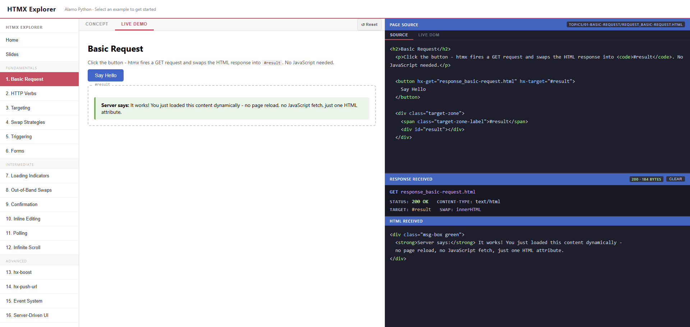

# HTMX Explorer

An interactive demo app for learning [htmx](https://htmx.org) - built for [Alamo Python](https://alamopython.com).

Browse 16 concepts from beginner to "I could build a real app", with a live demo and request/response inspector for each one.

<div style="display:flex;align-items:center;gap:24px;">
  
  
</div>

## Quick Start

```bash
git clone https://github.com/rchrdgwr/htmx-explorer.git
cd htmx-explorer
python server.py
```

Then open **http://localhost:8765** in your browser.

Python 3.7+ required. No other dependencies.

## What's Inside

| #   | Concept            | What you learn                                   |
| --- | ------------------ | ------------------------------------------------ |
| 1   | Basic Request      | `hx-get`, server returns HTML not JSON           |
| 2   | HTTP Verbs         | `hx-get` `hx-post` `hx-put` `hx-delete`          |
| 3   | Targeting          | `hx-target` with CSS selectors and `closest`     |
| 4   | Swap Strategies    | `hx-swap` - innerHTML, outerHTML, beforeend…     |
| 5   | Triggering         | `hx-trigger` - clicks, keyup, hover, polling     |
| 6   | Forms              | `hx-post` on a form, validation, inline errors   |
| 7   | Loading Indicators | Spinners with `hx-on` events                     |
| 8   | Out-of-Band Swaps  | `hx-swap-oob` - one response, many targets       |
| 9   | Confirmation       | `hx-confirm` before destructive actions          |
| 10  | Inline Editing     | Click to edit, save returns updated view         |
| 11  | Polling            | `hx-trigger="every 5s"`                          |
| 12  | Infinite Scroll    | `hx-trigger="revealed"`                          |
| 13  | hx-boost           | Convert links/forms without changing them        |
| 14  | hx-push-url        | Browser history and bookmarkable URLs            |
| 15  | Event System       | Custom events, decoupled components              |
| 16  | Server-Driven UI   | Patterns: CRUD, wizard, dashboard, master/detail |

## How It Works

Each example has a **Concept** tab - explains the idea with a diagram and code snippet - plus
one demo tab per live demo, running against the local server. A topic with a single demo just
shows **Live Demo**; a topic with multiple demo variants (e.g. Confirmation: Standard vs. Custom
Modal) shows one tab per variant, labeled **Demo - `<name>`**.

The right panel shows:

- **Page Source** - the body HTML with htmx attributes
- **Response Received** - the actual HTML fragment returned by the server

## Structure

```
htmx_explorer/
├── server.py          # Local dev server (handles GET/POST/PUT/DELETE)
├── index.html         # Explorer shell
├── home.html          # Landing page
├── slides.html        # Intro slide deck (9 slides)
├── css/                # Shared stylesheets (concept.css, examples.css, responses.css)
└── topics/             # One folder per topic - everything for a topic lives together
    └── 01-basic-request/
        ├── concept_basic-request.html   # Explanation + diagram
        ├── request_basic-request.html   # Live demo page
        └── response_basic-request.html  # HTML fragment(s) the server returns
```

Topics with more than one server response (e.g. Inline Editing, Server-Driven UI) just have
multiple `response_<topic>_<name>.html` files side by side.

Each topic is registered in the `EXAMPLES` map in `index.html` with a `concept` file and a
`demos` array. Most topics have a single demo:

```js
'basic-request': { label: '1. Basic Request', concept: 'topics/01-basic-request/concept_basic-request.html', demos: [
  { label: 'Live Demo', file: 'topics/01-basic-request/request_basic-request.html' }
]},
```

A topic can have more than one demo variant - each gets its own file in the same topic folder
(e.g. `request_confirmation.html` and `request_confirmation_custom-dialog.html`) and its own
entry in the `demos` array:

```js
'confirmation': { label: '9. Confirmation', concept: 'topics/09-confirmation/concept_confirmation.html', demos: [
  { label: 'Standard',     file: 'topics/09-confirmation/request_confirmation.html' },
  { label: 'Custom Modal', file: 'topics/09-confirmation/request_confirmation_custom-dialog.html' },
]},
```

Once `demos` has more than one entry, the app automatically renders one tab per variant - no
other code changes needed.

**To add a new topic:** create `topics/<NN>-<name>/`, add `concept_<name>.html` and at least one
`request_<name>.html` + `response_<name>.html`, add a sidebar button calling
`loadExample(this, '<name>')`, and register it in `EXAMPLES`.

**To add a new demo to an existing topic:** drop the new `request_<topic>_<variant>.html` file
in that topic's folder and push another `{ label, file }` object onto its `demos` array.

## The Big 6

If you only remember six things, these cover 80–90% of real htmx apps:

```html
hx-get hx-post hx-target hx-swap hx-trigger hx-swap-oob
```

And: **the server returns HTML, not JSON.**

## Resources

- [htmx.org](https://htmx.org) - official docs
- [htmx Discord](https://htmx.org/discord) - community
- [Hypermedia Systems](https://hypermedia.systems) - free book by the htmx author
- [django-htmx](https://github.com/adamchainz/django-htmx) - Django integration
- [Flask + htmx](https://github.com/Konfuzzyus/htmx-flask) - Flask integration

## License

MIT
